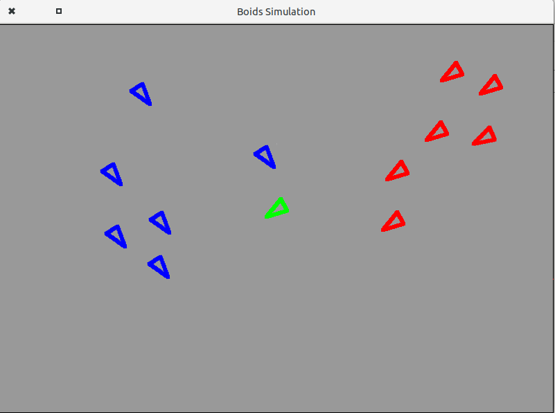

# Boids demonstration with AWT graphical user interface

## Launching the demonstration

* From SARL ID:
  1. Create a launch configuration of type "SARL Application"
  2. As the main class, select `io.sarl.demos.boids.BoidsSimulationLauncher`
* From command-line interface:
  1. Launch the application as a standard Java program.

## Description of the software

Boids is an artificial life program, developed by Craig Reynolds in 1986, which simulates the flocking behaviour of birds. The name "boid" corresponds to a shortened version of "bird-oid object", which refers to a bird-like object.

As with most artificial life simulations, Boids is an example of emergent behavior; that is, the complexity of Boids arises from the interaction of individual agents (the boids, in this case) adhering to a set of simple rules. The rules applied in the simplest Boids world are as follows:

* separation: steer to avoid crowding local flockmates;
* alignment: steer towards the average heading of local flockmates;
* cohesion: steer to move toward the average position (center of mass) of local flockmates.

More complex rules can be added, such as obstacle avoidance and goal seeking.

The basic model has been extended in several different ways since Reynolds proposed it. For instance, Delgado-Mata et al. extended the basic model to incorporate the effects of fear. Olfaction was used to transmit emotion between animals, through pheromones modelled as particles in a free expansion gas. Hartman and Benes introduced a complementary force to the alignment that they call the change of leadership. This steer defines the chance of the boid to become a leader and try to escape.

The movement of Boids can be characterized as either chaotic (splitting groups and wild behaviour) or orderly. Unexpected behaviours, such as splitting flocks and reuniting after avoiding obstacles, can be considered emergent.

The boids framework is often used in computer graphics, providing realistic-looking representations of flocks of birds and other creatures, such as schools of fishes or herds of animals. It was for instance used in the 1998 video game Half-Life for the flying bird-like creatures seen at the end of the game on Xen, named "boid" in the game files.

The Boids model can be used for direct control and stabilization of teams of simple Unmanned Ground Vehicles (UGV) or Micro Aerial Vehicles (MAV) in swarm robotics. For stabilization of heterogeneous UAV-UGV teams, the model was adapted for using onboard relative localization by Saska et al.

[**Code on GitHub**](https://github.com/sarl/sarl/tree/master/contribs/io.sarl.examples/io.sarl.examples.plugin/projects/io-sarl-demos-boids-awt)
